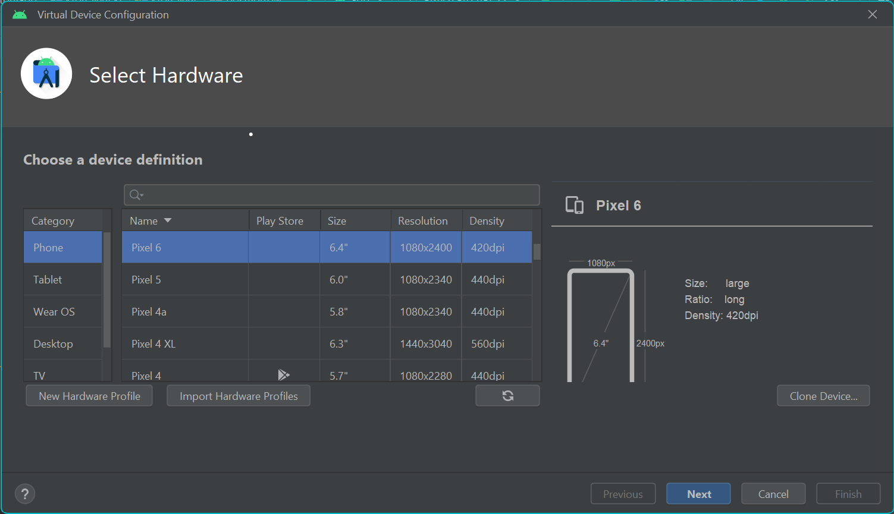
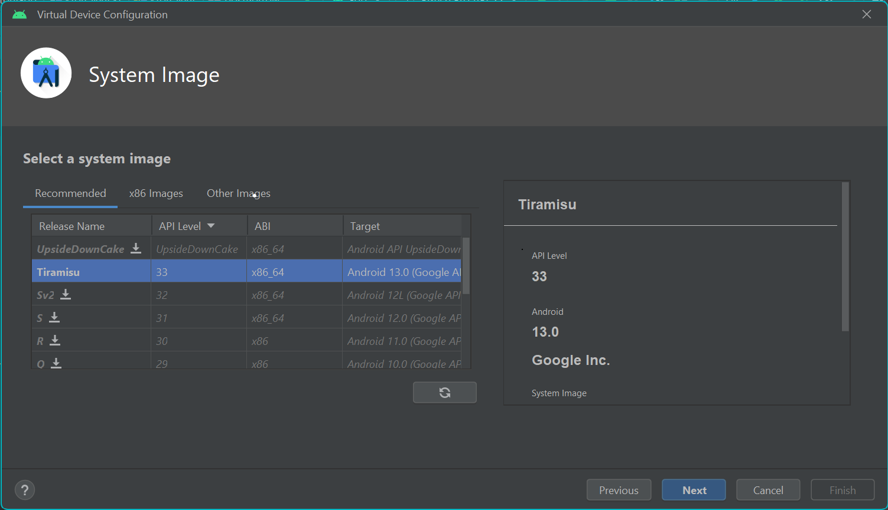
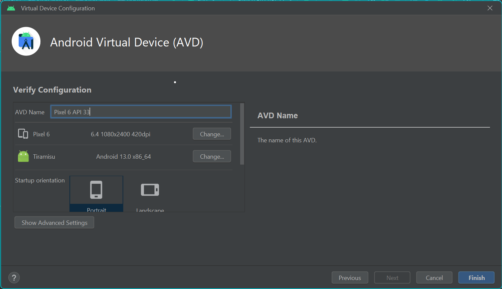
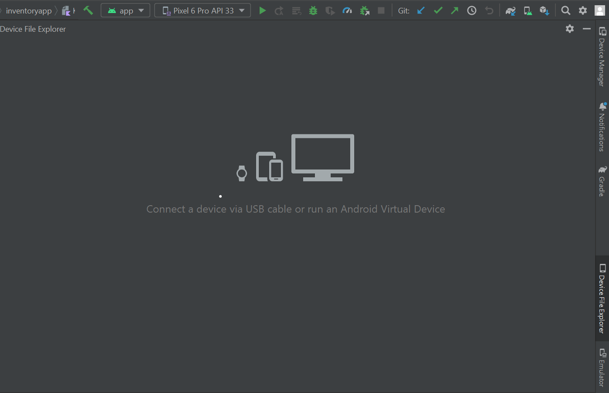
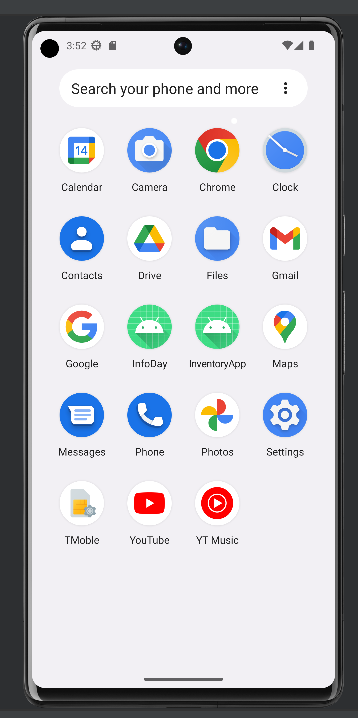
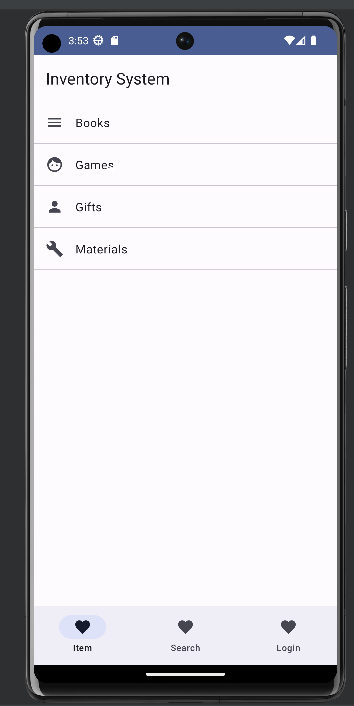

# comp4107-spring2023-inventoryapp-JennyChimHY
Instructions on how to set up and run the application, the project demo video link.

## Set up the application

1. You may click the device manager --> "Create Device".
2. Then, you can choose pixel 6 and press "Next".

3. Download and select "Tiramisu" with API 33.

4. Press "Finish" and the device will be ready to be emulated.

## Run the application

1. Click App next to the Android icon, select the device and run.

2. Open the emulator item on the bottom right bar. If the app doesn't open automatically, you can open the app "InventoryApp".

3. The app can be run.

## Project Demo Video Link

Here is my demo video.

https://lifehkbueduhk-my.sharepoint.com/:f:/g/personal/20226942_life_hkbu_edu_hk/Eong3uUNu3tIh_-pnULJX3gBe6gDvYr10esO-YVlL48TEg?e=gTMiVf
